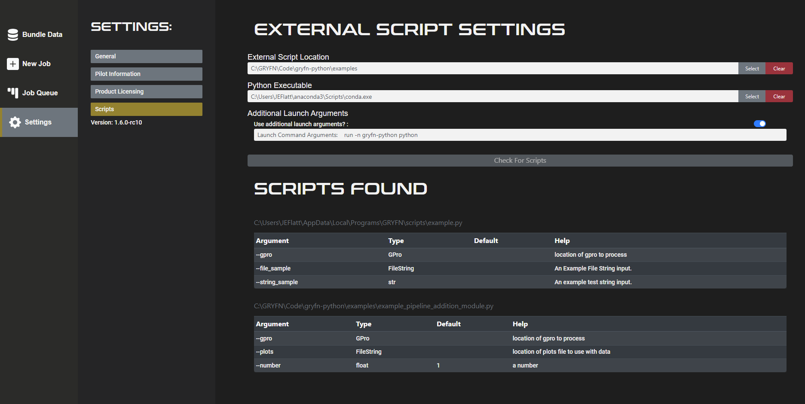

# gryfn-python

## Description
gryfn-python is a python package that helps index and query processed GRYFN data in it's original (.gpro) structure.
Use gryfn-python to pass input arguments to your custom python scripts through GRYFN Processing Tool and simplify post-processing
on your GRYFN processed data.

## Installation
gryfn-python can be installed from a wheel file or source code included with each release. Both methods are described below.

> &#128221; Be sure to install gryfn-python in your intended Python environment 

### From Wheel
 * Download the wheel file to a local directory.
 * Navigate into the directory
   ```
   cd C:\Users\YourUserName\Downloads\
   ```
 * Install gryfn-python
   ```
   pip install gryfn-0.1-py3-none-any.whl
   ```

### From Source
 * Download the source code and extract it into a local directory.
 * Navigate into the directory where setup.py is located
   ```
   cd C:\Users\YourUserName\Downloads\
   ```
 * Install gryfn-python
   ```
   python setup.py install
   ```

## Setup
To use gryfn-python in GRYFN Processing Tool, External Scripts Settings must be configured.
An example is given below for a python conda environment named ```gryfn-python```



## Usage
See [examples](examples) directory

## Roadmap
* Improve usage section
* Make public
* Make available through normal python package distributions?

## Authors and acknowledgment
Kenneth Tussey

## Project status
Stable
